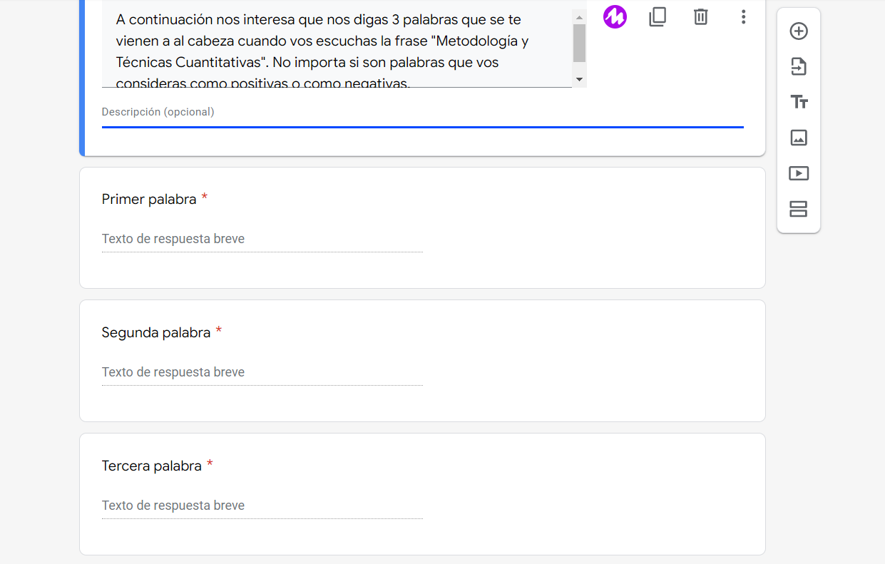

# Análisis de textos

```{r text_librerias, include=FALSE}
# Levanto el dataset de la encuesta

library(stringr)
library(tidytext)
library(hunspell) # Funciona mejor para el español. Uso la versión de desarrollo porque
# funciona mejor los diccionario en rstudio
#devtools::install_github("ropensci/hunspell", force = TRUE)
library(purrr)
library(tidyverse)
           
```

```{r text_insumo, include=FALSE}
# Levanto el dataset de la encuesta

df_encuesta <- read_rds(here::here("Outputs", "df_encuesta.rds"))
```

El insumo de estos análisis es una serie de preguntas de respuesta abierta. Sin embargo, dado el formato específico de la pregunta se trata de un dato que, si bien no puede considerarse estructurado, se aleja un poco de otros ejemplos de datos no estructurados como los textos provenientes de entrevistas en profundidad, de canciones o de discursos presidenciales.

{width="600"}

En este caso, como puede observarse en la imagen se trata de 3 palabras por cada encuestado. Expresado en el léxico de una matriz de datos (o base de casos x variables), se trata de 3 columnas por cada fila.

## Preparación de los datos

Para facilitar el siguiente análisis lo que primero debemos realizar es un "alargamiento" de la base de datos original para pasar a tener una sola columna y más filas que, en principio, se repetirían 3 veces.

```{r text_longer, include=FALSE}

df_longer <- df_encuesta |>
             select(dni, 
                    unaj_ano_ingreso,
                    unaj_n_materias_aprobadas_10,
                    unaj_n_materias_aprobadas_15,
                    sexo,
                    hog_convivencia_hijes,
                    cuanti_1_palabra, 
                    cuanti_2_palabra, 
                    cuanti_3_palabra) |>
             pivot_longer(c(cuanti_1_palabra,
                          cuanti_2_palabra,
                          cuanti_3_palabra),
                          names_to = "orden_palabra",
                          values_to = "cuanti_palabras")
                      
```

Luego, sigue el proceso de limpieza de las palabras. Se pasa todo a minúscula, se eliminan los puntos, los números y toda palabra vacía de significado como los pronombres, artículos y preposiciones. Finalmente se hace un proceso en donde se intenta llevar todas las palabras a su raíz (*stemming*) para así poder interpretar como una misma palabra a palabras que, por ejemplo, cambian el género (gato, gata) o el número (gato, gatos). Ahora sí, ya estamos en mejores condiciones de empezar nuestro análisis del texto.

```{r cleaning_palabras_cuanti, include=FALSE}

# Comienzo el proceso de transformación desde cuanti_palabras a cuanti_palabras_ok
# Se sacan los puntos
# Se pasa todo a minúscula. Es importante porque el stemming y las stopword funcionan mejor
# Se sacan las stopwords
# Se hace el stemming
# Se sacan los acentos. Esto va a lo último porque modifica el stemming.

# Se sacan las "s"
# Se sacan las stopword (quanteda tiene uno bueno pero primera hay que token)
# Tidytext tiene un wraping para la funcion stopword del paquete stopwords
# El proceso de stemming lo hago con hunspell en vez de que con snowball. 
# 
# Cambio a mano el diccionario de hunspell y luego lo especifico en el código

# Creo in objeto con los stopword. Uso tidytext para hacer un antijoint pero la base de datos
# sale del paquete stopwords que, a su turno, levanta base de distintos lugares.
# El stopword lo uso luego de poner las palabras en minúsculas

cuanti_stopwords <- get_stopwords(language = "es", source = "nltk") |> # Por ahora nltk tiene más palabras
                    rename(cuanti_stopwords = word)

df_longer <- df_longer |>
mutate(
cuanti_palabras_ok = str_replace(cuanti_palabras, "[.]+$", ""), # Saco los puntos
cuanti_palabras_ok = str_to_lower(cuanti_palabras_ok)) # Todo a minuscula

df_longer <- df_longer |> 
anti_join(cuanti_stopwords, by = c("cuanti_palabras_ok" = "cuanti_stopwords")) # Stopwords

# Antes del stemming pruebo con el corrector de palabras
# 
# Si previamente el (nuevo) diccionario ya está creado se buscar como un nuevo lenguaje de diccionario
# Me sirve para stemming

cuanti_diccionario <- hunspell::dictionary(lang = "es_ES_delta")

df_longer <- df_longer |>
mutate(
cuanti_palabras_analyze = hunspell_analyze(cuanti_palabras_ok, cuanti_diccionario),
cuanti_palabras_check = hunspell_check(cuanti_palabras_ok, cuanti_diccionario),
cuanti_palabras_suggest = hunspell_suggest(cuanti_palabras_ok, cuanti_diccionario))

# La idea es la siguiente:
# Si el check dió false, va la (única) palabra que salió en suggest.
# Si el check dió true, va la primera palabra de la lista

#df_longer$cuanti_palabras_suggest #df_longer$cuanti_palabras_suggest[sapply(length(df_longer$cuanti_palabras_suggest == 0))] #if_else(df_longer$cuanti_palabras_suggest[sapply(length(df_longer$cuanti_palabras_suggest == 0))],
         #                                   NA,
#                                            cuanti_palabras_suggest)

df_longer <- df_longer |>
mutate(cuanti_palabras_pre_stem = map(cuanti_palabras_suggest,1))

df_longer$cuanti_palabras_pre_stem[sapply(df_longer$cuanti_palabras_pre_stem, is.null)] <- NA

df_longer <- df_longer |>
mutate(cuanti_palabras_pre_stem = unlist(cuanti_palabras_pre_stem))

# Stemming
# Así como para las stopwords hice un archivo específico ahora hago un
# diccionario que agrega más palabras al original
# Hay que tener cuidado porque "quanteda" pisa a dictionary de "hunspell"

df_longer <- df_longer |>
mutate(cuanti_palabras_stem = hunspell_stem(cuanti_palabras_pre_stem, dict = cuanti_diccionario))

df_longer <- df_longer |>
mutate(cuanti_palabras_stem = map(cuanti_palabras_stem,1))

df_longer$cuanti_palabras_stem[sapply(df_longer$cuanti_palabras_stem, is.null)] <- NA

df_longer <- df_longer |>
mutate(cuanti_palabras_stem = unlist(cuanti_palabras_stem))

# Arreglo a mano algunos pequeños casos

df_longer <-  df_longer |>
mutate(
cuanti_palabras_pre_stem = str_replace(cuanti_palabras_pre_stem, "métodos", "método"),
cuanti_palabras_pre_stem = str_replace(cuanti_palabras_pre_stem, "cantidades", "cantidad"),
cuanti_palabras_pre_stem = str_replace(cuanti_palabras_pre_stem, "estadísticas", "estadística"),
cuanti_palabras_pre_stem = str_replace(cuanti_palabras_pre_stem, "encuestas", "encuesta"),
cuanti_palabras_pre_stem = str_replace(cuanti_palabras_pre_stem, "técnicas", "técnica"),
cuanti_palabras_pre_stem = str_replace(cuanti_palabras_pre_stem, "porcentajes", "porcentaje"),
cuanti_palabras_pre_stem = str_replace(cuanti_palabras_pre_stem, "cuentas", "contar"))      

          
#cuanti_palabras_ok = stringi::stri_trans_general(cuanti_palabras_ok, "Latin-ASCII")), # Saco los acentos

#df_longer <- df_longer |>
#mutate(
#cuanti_palabras_hunspell = hunspell_stem(cuanti_palabras_ok, dict = cuanti_diccionario))


#cuanti_palabras_snowballc = wordStem(cuanti_palabras, language = "spanish"))

#cuanti_palabras_hunspell_check = hunspell_check(cuanti_palabras, dict = dictionary("es_ES")),
```

## Primeras aproximaciones

Dado que los pasos anteriores nos permitieron estructurar bastante los datos, ahora es más fácil realizar los típicos análisis que se realizan a los datos estructurados. Para comenzar vamos a realizar una simple tabla de conteo, con su respectivo porcentaje, y luego vamos a realizar un gráfico de barras. Finalmente realizaremos una nube de palabras.

```{r tablas_conteos, echo=FALSE}

library(dplyr)
library(gt)

conteo_palabras_general <- df_longer |>
filter(!is.na(cuanti_palabras_pre_stem)) |>
  count(cuanti_palabras_pre_stem) |>
  arrange(desc(n)) |>
  filter(n > 1) |>
  mutate(Porcentaje = n/sum(n))

gt_palabras <- conteo_palabras_general |>
  gt() |>
  tab_header(title = "Frecuencia y porcentajes de palabras") |>
  cols_label(cuanti_palabras_pre_stem = "Palabra",
             n = "Cantidad") |>
  fmt_percent(columns = Porcentaje)

gt_palabras


        
```

Como en muchas otras situaciones, lo que se puede mostrar en forma de tabla también se puede graficar con algún tipo de gráfico. En este caso haremos un gráfico de barras con los datos anteriores.

```{r grafico_conteo, echo=FALSE}
library(ggplot2)

grafico_conteo <- conteo_palabras_general |>
mutate(cuanti_palabras_pre_stem = fct_reorder(cuanti_palabras_pre_stem, n)) |>
ggplot(aes(cuanti_palabras_pre_stem, Porcentaje)) +
       geom_col() + 
      labs(x = "Palabras") +
      scale_y_continuous(labels = scales::percent) +
       coord_flip()
       
grafico_conteo
```

## Nube de palabras

La nube de palabras es una técnica de visualización que funciona bien cuando los insumos son palabras y estan presentan una gran heterogeneidad en los valores de sus frecuencias.

```{r text_nube_general, echo=FALSE}

library(ggwordcloud)

nube_palabras <- ggplot(conteo_palabras_general, 
       aes(label = cuanti_palabras_pre_stem, 
           size = n,
           color = n)) +
  geom_text_wordcloud(area_corr = TRUE) +
  scale_size_area(max_size = 20) +
  labs(title = "Nube de palabras") +
  theme(plot.title = element_text(hjust = 0.5))

nube_palabras
```

## Análisis bivariado de palabras

```{r text_bivariado, echo=FALSE}
# Es más cómodo "ensanchar" la base luego del análisis para facilitar la tabla

conteo_palabras_grupo <- df_longer |>
filter(!is.na(cuanti_palabras_pre_stem)) |>
 group_by(unaj_n_materias_aprobadas_15) |>
  count(cuanti_palabras_pre_stem) |>
  arrange(desc(n)) |>
  filter(n > 1) |>
  mutate(Porcentaje = n/sum(n)) |>
  select(!n) |>
  pivot_wider(names_from = unaj_n_materias_aprobadas_15,
              values_from = Porcentaje)

gt_palabras_grupo <- conteo_palabras_grupo |>
  gt() |>
  tab_header(title = "Frecuencia y porcentajes de palabras según cantidad de materias aprobadas") |>
  cols_label(cuanti_palabras_pre_stem = "Palabra") |>
    tab_spanner(
    label = "Cantidad de materias aprobadas",
    columns = c("Hasta 15", "Más de 15")) |>
  fmt_percent(columns = c("Hasta 15", "Más de 15"))
              

gt_palabras_grupo
```

```{r nube_palabras_grupo, echo=FALSE}

conteo_palabras_grupo <- df_longer |>
filter(!is.na(cuanti_palabras_pre_stem)) |>
  group_by(unaj_n_materias_aprobadas_15) |>
  count(cuanti_palabras_pre_stem) |>
  arrange(desc(n)) |>
  filter(n > 1) |>
  mutate(Porcentaje = n/sum(n))

 nube_palabras_grupo <- ggplot(conteo_palabras_grupo, 
       aes(label = cuanti_palabras_pre_stem, 
           size = n,
           color = n)) +
  geom_text_wordcloud(area_corr = TRUE) +
  scale_size_area(max_size = 10) +
  labs(title = "Nube de palabra según cantidad de materias aprobadas") +
  theme(plot.title = element_text(hjust = 0.5)) +
  facet_wrap(~unaj_n_materias_aprobadas_15)
 
 nube_palabras_grupo
```

## 
