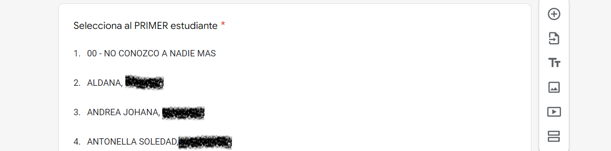

---
---
---

# Análisis de redes

```{r librerias_redes}
library(tidygraph)
library(ggraph)
library(stringr)
library(tidyverse)
library(here)
           
```

```{r insumo_redes}
# Levanto el dataset de la encuesta
# Pongo "redes_tu_nombre"como primera columna
df_encuesta <- read_rds(here::here("Outputs", "df_encuesta.rds")) |>
               relocate(redes_tu_nombre)
```

## Insumo de la encuesta

El insumo de estos análisis es una serie de preguntas en donde cada estudiante debe elegir, entre todos los estudiantes de ese cuatrimestre, a los 5 a los que más conoce. Como tal este módulo puede considerarse como una serie de preguntas cerradas de respuesta única...pero con muuuchas opciones. Lo importante no es tanto que las opciones sean muchas o pocas sino que el rango de estas es conocido y discreto.

Luego de una primera pregunta en donde el estudiante se auto identifica en la lista se pasa a otras 5 preguntas en donde el estudiante va eligiendo a otres compañeros a los cuales más conoce. Si no conoce a nadie más elige la opción "00-NO CONOZCO A NADIE MAS" en las siguientes preguntas.

<center>

{width="600"}

{width="600"}

</center>

## Breve introducción al análisis de redes

```{r nodes}
nodes <- df_encuesta

```

```{r edges}
# Hay que realizar desde el archivo de la encuesta dos columnas (from, to) en donde
# el "from" sea el encuestado "redes_tun_nombre" y que el "to" sea el estudiante a quien haya 
# elegido. Dado que cada encuestado elige a 5 estudiantes en este nuevo objeto debería
# haber 5 filas por encuestado.
# Luego de eso se debería filtrar "los edges" para que queden sólo aquellos que están presentes
# en el "nodes", esto es, con los que contestaron la encuesta.
# 
# Se podría agregar otras columnas al edge
#       cuanti_comision,
#                       unaj_ano_ingreso,
#                       unaj_n_materias_aprobadas,
#                       unaj_n_materias_aprobadas_10

edges <- df_encuesta |>
                select(mail,
                       redes_tu_nombre,
                       redes_1_contacto,
                       redes_2_contacto,
                       redes_3_contacto,
                       redes_4_contacto,
                       redes_5_contacto,
                       cuanti_docente,
                       unaj_ano_ingreso,
                       unaj_n_materias_aprobadas,
                       unaj_n_materias_aprobadas_10) |>
                pivot_longer(c(
                             redes_1_contacto,
                             redes_2_contacto,
                             redes_3_contacto,
                             redes_4_contacto,
                             redes_5_contacto),
                             names_to = "orden_del_contacto",
                             values_to = "to") |>
mutate(intensidad_relacion = as.integer(case_when(orden_del_contacto == "redes_1_contacto" ~ "1",
                                                     orden_del_contacto == "redes_2_contacto" ~ "2",
                                                     orden_del_contacto == "redes_3_contacto" ~ "3",
                                                     orden_del_contacto == "redes_4_contacto" ~ "4",
                                                     orden_del_contacto == "redes_5_contacto" ~ "5"))) |>
              select(!c(mail, orden_del_contacto)) |>
              semi_join(nodes, by = c("to" = "redes_tu_nombre")) |>
              rename(from = redes_tu_nombre) |>
              relocate(to)
          
```

```{r red}
# Creo la red 
red <- tbl_graph(nodes = nodes,
                 node_key = "redes_tu_nombre",
                 edges = edges,
                 directed = TRUE)

# se puede agregar "directed = TRUE" pero algunas medidas de comunidad no se pueden calcular
```

El análisis de redes (*Network Analysis* o NA) es un enfoque que tiene una larga historia dentro de las ciencias en general. En efecto, puede considerarse como una aplicación de una teoría matemática abstracta como es la [teoría de grafos](https://es.wikipedia.org/wiki/Teor%C3%ADa_de_grafos) (*Graph Theory*). Esta última se origina en un [viejo artículo](https://drive.google.com/file/d/1Vr1BQT-7GAK9ia5YbMfYul4Lwzhv3LVP/view) de Leonard Euler de 1736 conocido como los «[Los siete puentes de Königsberg](https://es.wikipedia.org/wiki/Problema_de_los_puentes_de_K%C3%B6nigsberg)«.

En el caso más particular del [Análisis de Redes Sociales](https://es.wikipedia.org/wiki/An%C3%A1lisis_de_redes#An%C3%A1lisis_de_Redes_Sociales) (Social *Network Analysis* o SNA) su origen tiene 2 patas diferenciadas. Por un lado, tuvo que ver con la invención del [sociograma](https://es.wikipedia.org/wiki/Sociograma), el cual, a su turno, tuvo que ver con el origen de la [sociometría](https://es.wikipedia.org/wiki/Sociometr%C3%ADa). El sociograma es una herramienta de visualización de las relaciones sociales que conforman un grupo. Para su construcción se requiere de datos de todos los miembros de ese grupo por lo que su utilización muchas veces se restringue a grupos o organizaciones pequeños. En parte por lo anterior, no son muchas las investigaciones empíricas que lo utilizan dada la dificultad metodológica de obtener esos datos.

Recién luego de varias décadas la visualización del sociograma se relacionó explícitamente con la teoría de grafos, dando origen al SNA. Si los sociogramas tenían la dificultad metodológica de su construcción, con la incorporación de la teoría de grafos se sumo la dificultad metodológica del análisis de esos datos. Estas 2 condiciones afectan mucho el grado de difusión de este enfoque. En parte por lo anterior, en lo que sigue se mostrará como se pueden hacer análisis y visualizaciones de redes con datos provenientes de una base original de casos x columnas.[^redes-1]

## Análisis y visualizaciones

### Centralidades de los estudiantes y sus relaciones

En un grafo, los nodos (*nodes*) representan a los entes relacionados (aquí estudiantes) y las líneas (*edges*) representan a las relaciones entre ellos. En este caso primero vamos a calcular una medida de centralidad de los nodos en función de las relaciones que cada uno tiene y con quién. En este sentido, no es lo mismo conocer a 5 personas que son pocos conocidos que conocer a 5 personas que son muy conocidas por otros. En el casos de las relaciones vamos a calcular otra medida de centralidad basada en la idea de intermediación . [^redes-2]

```{r red_diego}
red_diego <- red |>
activate(nodes) |>
filter(cuanti_docente == "Diego Quartulli") |>
filter(!is.na(unaj_n_materias_aprobadas_10)) |>
mutate(pagerank = centrality_pagerank(),
       siglas = str_sub(redes_tu_nombre, start = 1L, end = 5L),
       comunidad = as.factor(group_components())) |>
activate(edges) |>
mutate(intermediacion = centrality_edge_betweenness())
```

```{r grafo_comision_diego}

grafo_diego <- ggraph(red_diego, layout = "kk") +
geom_edge_link(aes(alpha = intermediacion)) + 
geom_node_point(aes(size = pagerank, colour = pagerank)) +
scale_color_continuous(guide = 'legend') +
theme_graph()
grafo_diego

ggsave(here("Outputs", "grafo_diego.png"))

# En este link hay varias buenas opciones de gráficos
# http://users.dimi.uniud.it/~massimo.franceschet/ns/syllabus/make/tidygraph/tidygraph.html
```

En el siguiente grafo

```{r}
nodos <- red_diego |>
activate(nodes) |>
as_tibble()
```

    g %>% 
      activate(nodes) %>%
      mutate(community = as.factor(group_louvain())) %>% 
      ggraph(layout = 'kk') + 
      geom_edge_link(aes(alpha = stat(index)), show.legend = FALSE) + 
      geom_node_point(aes(colour = community), size = 5) + 
      theme_graph()

```{r comunidad_diego}
comunidad_diego <- ggraph(red_diego, layout = "kk") + 
  geom_edge_link(aes(alpha = stat(index)), show.legend = FALSE) + 
  geom_node_point(aes(colour = comunidad), size = 5) +
  geom_node_text(aes(label = siglas), repel = TRUE)
 theme_graph()
comunidad_diego

```

[^redes-1]: En general, en el SNA existen 3 tipos de registros de datos que permiten su posterior visualización y análisis. Estos son a) una matriz de adyacencia (*adjacency matrix*), b) una lista de adyacencia (*adjacency list*) y c) una lista de lazos (e*dge list*). Lo interesante es los ultimos 2 casos se pueden interpretar como 2 bases de "casos x columnas" que, su turno, se pueden construir desde una única típica base de "casos x columnas" que tenga origen en preguntas como las de arriba detalladas.

[^redes-2]: Estrictamente existen múltiples medidas de centralidad. Aquí, para el caso de los nodos se calculó el *pagerank* que essimilar al que utiliza google para ordenar las páginas en las búsquedas. En el caso de las relaciones se calculó una medida de centralidad basada en la intermediación, que tiene en cuenta el número de caminos más cortos que pasan por una relación en un grafo.
