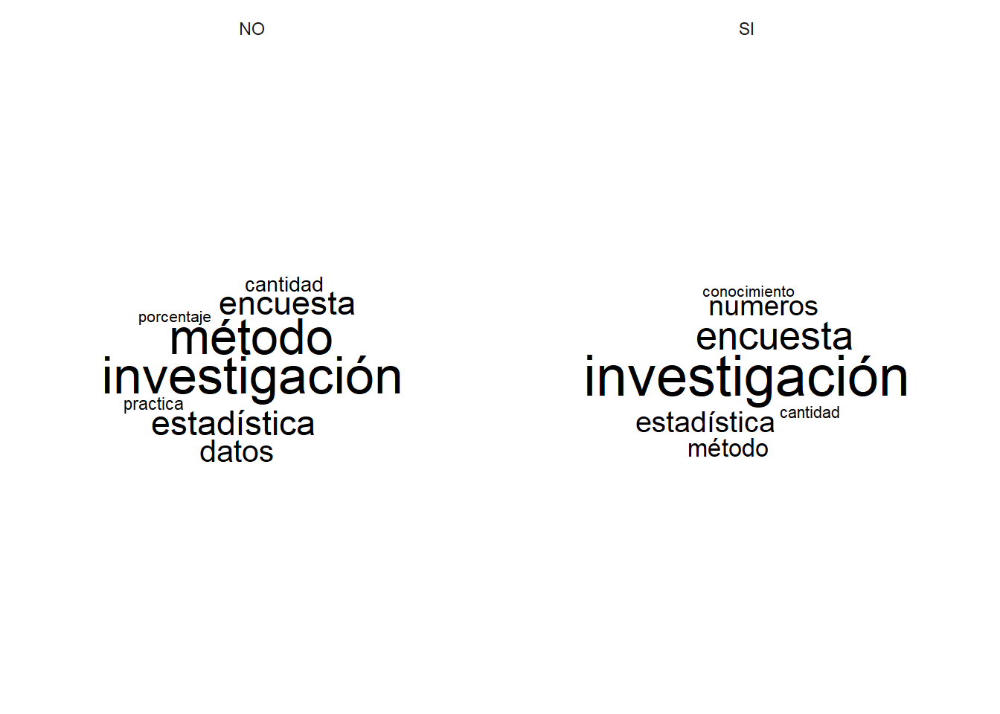

---
output:
  pdf_document: default
  html_document: default
---
---

# Análisis de texto


```r
# Levanto el dataset de la encuesta

library(stringr)
library(tidytext)
library(hunspell) # Funciona mejor para el español. Uso la versión de desarrollo porque
# funciona mejor los diccionario en rstudio
#devtools::install_github("ropensci/hunspell", force = TRUE)
library(purrr)
library(tidyverse)
#> -- Attaching packages ------------------- tidyverse 1.3.1 --
#> v ggplot2 3.3.5     v readr   2.1.2
#> v tibble  3.1.6     v dplyr   1.0.8
#> v tidyr   1.2.0     v forcats 0.5.1
#> -- Conflicts ---------------------- tidyverse_conflicts() --
#> x dplyr::filter() masks stats::filter()
#> x dplyr::lag()    masks stats::lag()
```


```r
# Levanto el dataset de la encuesta

df_encuesta <- read_rds(here::here("Outputs", "df_encuesta.rds"))
```

El insumo de estos análisis es una serie de preguntas de respuesta abierta. Sin embargo, dado el formato específico de la pregunta se trata de un dato que, si bien no puede considerarse estructurado, se aleja un poco de otros ejemplos de datos no estructurados como los textos provenientes de entrevistas en profundidad, de canciones o de discursos presidenciales.

En este caso se trata de 3 palabras por cada encuestado. Expresado en el léxico de una matriz de datos se trata de 3 columnas por cada fila. Para facilitar el siguiente análisis lo que primero debemos realizar es un "alargamiento" de la matriz de datos para tener una sola columna y más filas que, en principio, se repetirían 3 veces.


```r

df_longer <- df_encuesta |>
             select(dni, 
                    unaj_ano_ingreso,
                    unaj_n_materias_aprobadas,
                    sexo,
                    hog_convivencia_hijes,
                    cuanti_1_palabra, 
                    cuanti_2_palabra, 
                    cuanti_3_palabra) |>
             pivot_longer(c(cuanti_1_palabra,
                          cuanti_2_palabra,
                          cuanti_3_palabra),
                          names_to = "orden_palabra",
                          values_to = "cuanti_palabras")
                      
```


```r

# Comienzo el proceso de transformación desde cuanti_palabras a cuanti_palabras_ok
# Se sacan los puntos
# Se pasa todo a minúscula. Es importante porque el stemming y las stopword funcionan mejor
# Se sacan las stopwords
# Se hace el stemming
# Se sacan los acentos. Esto va a lo último porque modifica el stemming.

# Se sacan las "s"
# Se sacan las stopword (quanteda tiene uno bueno pero primera hay que token)
# Tidytext tiene un wraping para lafuncion stopwprd del paquete stopwords
# El proceso de stemming lo hago con hunspell en vez de snowball. 
# 
# Cambio a mano el diccionario de hunspell y luego lo especifico en el código

# Creo in objeto con los stopword. Uso tidytext para hacer un antijoint pero la base de datos
# sale del paquete stopwords que, a su turno, levante base de distintos lugares.
# El stopword lo uso luego de poner las palabras en minúsculas

cuanti_stopwords <- get_stopwords(language = "es", source = "nltk") |> # Por ahora nltk tiene más palabras
                    rename(cuanti_stopwords = word)

df_longer <- df_longer |>
mutate(
cuanti_palabras_ok = str_replace(cuanti_palabras, "[.]+$", ""), # Saco los puntos
cuanti_palabras_ok = str_to_lower(cuanti_palabras_ok)) # Todo a minuscula

df_longer <- df_longer |> 
anti_join(cuanti_stopwords, by = c("cuanti_palabras_ok" = "cuanti_stopwords")) # Stopwords

# Antes del stemming pruebo con el corrector de palabras
# 
# Si previamente el (nuevo) diccionario ya está creado se buscar como un nuevo lenguaje de diccionario
# Me sirve para stemming

cuanti_diccionario <- hunspell::dictionary(lang = "es_ES_delta")

df_longer <- df_longer |>
mutate(
cuanti_palabras_analyze = hunspell_analyze(cuanti_palabras_ok, cuanti_diccionario),
cuanti_palabras_check = hunspell_check(cuanti_palabras_ok, cuanti_diccionario),
cuanti_palabras_suggest = hunspell_suggest(cuanti_palabras_ok, cuanti_diccionario))

# La idea es la siguiente:
# Si el check dió false, va la (única) palabra que salió en suggest.
# Si el check dió true, va la primera palabra de la lista

#df_longer$cuanti_palabras_suggest #df_longer$cuanti_palabras_suggest[sapply(length(df_longer$cuanti_palabras_suggest == 0))] #if_else(df_longer$cuanti_palabras_suggest[sapply(length(df_longer$cuanti_palabras_suggest == 0))],
         #                                   NA,
#                                            cuanti_palabras_suggest)

df_longer <- df_longer |>
mutate(cuanti_palabras_pre_stem = map(cuanti_palabras_suggest,1))

df_longer$cuanti_palabras_pre_stem[sapply(df_longer$cuanti_palabras_pre_stem, is.null)] <- NA

df_longer <- df_longer |>
mutate(cuanti_palabras_pre_stem = unlist(cuanti_palabras_pre_stem))

# Stemming
# Así como para las stopwords hice un archivo específico ahora hago un
# diccionario que agrega más palabras al original
# Hay que tener cuidado porque "quanteda" pisa a dictionary de "hunspell"

df_longer <- df_longer |>
mutate(cuanti_palabras_stem = hunspell_stem(cuanti_palabras_pre_stem, dict = cuanti_diccionario))

df_longer <- df_longer |>
mutate(cuanti_palabras_stem = map(cuanti_palabras_stem,1))

df_longer$cuanti_palabras_stem[sapply(df_longer$cuanti_palabras_stem, is.null)] <- NA

df_longer <- df_longer |>
mutate(cuanti_palabras_stem = unlist(cuanti_palabras_stem))

# Arreglo a mano algunos pequeños casos

df_longer <-  df_longer |>
mutate(
cuanti_palabras_pre_stem = str_replace(cuanti_palabras_pre_stem, "métodos", "método"),
cuanti_palabras_pre_stem = str_replace(cuanti_palabras_pre_stem, "cantidades", "cantidad"),
cuanti_palabras_pre_stem = str_replace(cuanti_palabras_pre_stem, "estadísticas", "estadística"),
cuanti_palabras_pre_stem = str_replace(cuanti_palabras_pre_stem, "encuestas", "encuesta"),
cuanti_palabras_pre_stem = str_replace(cuanti_palabras_pre_stem, "técnicas", "técnica"))      

          
#cuanti_palabras_ok = stringi::stri_trans_general(cuanti_palabras_ok, "Latin-ASCII")), # Saco los acentos

#df_longer <- df_longer |>
#mutate(
#cuanti_palabras_hunspell = hunspell_stem(cuanti_palabras_ok, dict = cuanti_diccionario))


#cuanti_palabras_snowballc = wordStem(cuanti_palabras, language = "spanish"))

#cuanti_palabras_hunspell_check = hunspell_check(cuanti_palabras, dict = dictionary("es_ES")),
```

De este modo es como si se hubiera armado una clave para cada palabra.


# Primeras aproximaciones


```r
library(dplyr)
conteo_palabras <- df_longer |>
filter(!is.na(cuanti_palabras_pre_stem)) |>
group_by(hog_convivencia_hijes) |>
  count(cuanti_palabras_pre_stem) |>
  arrange(desc(n)) |>
  filter(n > 2)
        
```

# Nube de palabras


```r
library(ggwordcloud)
ggplot(conteo_palabras, 
       aes(label = cuanti_palabras_pre_stem, size = n)) +
  geom_text_wordcloud(area_corr = TRUE) +
  scale_size_area(max_size = 10) +
  theme_minimal() +
  facet_wrap(~hog_convivencia_hijes)
```



La nube de palabras (*wordcloud*)

## Footnotes

Footnotes are put inside the square brackets after a caret `^[]`. Like this one [^text-1].

## Citations

Reference items in your bibliography file(s) using `@key`.

For example, we are using the **bookdown** package [@R-bookdown] (check out the last code chunk in index.Rmd to see how this citation key was added) in this sample book, which was built on top of R Markdown and **knitr** [@xie2015] (this citation was added manually in an external file book.bib). Note that the `.bib` files need to be listed in the index.Rmd with the YAML `bibliography` key.

The `bs4_book` theme makes footnotes appear inline when you click on them. In this example book, we added `csl: chicago-fullnote-bibliography.csl` to the `index.Rmd` YAML, and include the `.csl` file. To download a new style, we recommend: 

The RStudio Visual Markdown Editor can also make it easier to insert citations: 

[^text-1]: This is a footnote.
