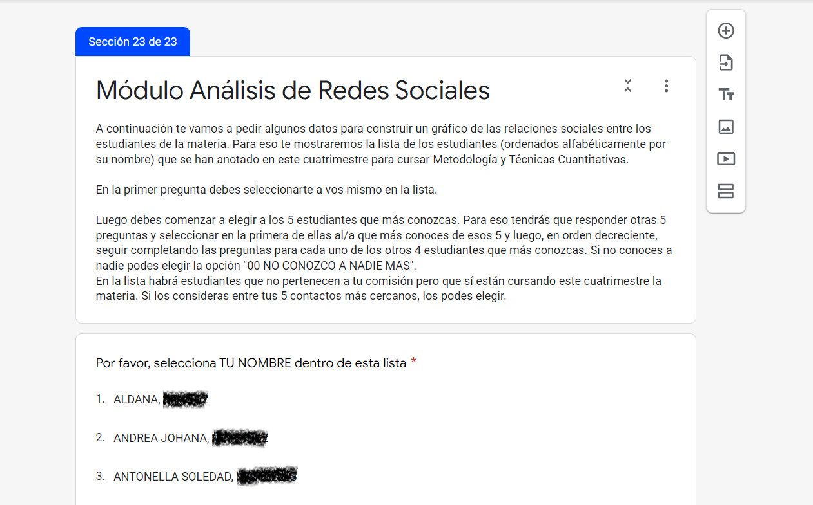

```{r include=FALSE, cache=FALSE}
# example R options set globally
options(width = 60)

# example chunk options set globally
knitr::opts_chunk$set(
  comment = "#>",
  collapse = TRUE
  )
```

# Presentación y objetivos del informe {.unnumbered}

El siguiente informe tiene una finalidad principalmente pedagógica. Específicamente está pensado como un mecanismo para ayudar a alcanzar los siguientes objetivos que forman parte del [programa](https://docs.google.com/document/d/15ZuHJ1ZM7Z0g0Edt-mv1PCB697-x6-rZfcWdAtd85yM/edit#heading=h.s43n504lcmmx "Ir al programa de la materia") de la materia "Metodología y Técnicas Cuantitativas" de la UNAJ:

-   Lograr un conocimiento mínimo de la existencia y pertinencia de las técnicas de análisis de datos *básicas* y una *habilidad* mínima en la ejecución de las mismas.

-   *Lograr un* conocimiento mínimo de la existencia y pertinencia de (otras) técnicas de análisis de datos más específicas y (usualmente) más *complejas*.

Aparte de la distinción entre técnicas básicas y complejas la diferencia en cuanto a los objetivos pedagógicos es que entre ambos objetivos es que las últimas sólo se aspira a conocerlas mientras que en las primeras se espera, también, que se adquiera cierta habilidad en su ejecución. Expresado de otro modo, de las técnicas consideradas complejas se espera que se sepa de su existencia y qué tipos de problemas ayuda a solucionar. En cambio, en las técnicas básicas se espera lo anterior pero que además se adquiera la habilidad de poder ejecutar las mismas.

Para lograr lo anterior durante la cursada de la materia se realiza una encuesta mediante un [formulario de google](https://www.google.com/intl/es-419_ar/forms/about/ "Ir a formularios de Google") que contestan los mismos estudiantes. Luego el contenido de sus respuestas se analiza con el [programa R](https://www.r-project.org/ "Ir al programa R") y con el mismo programa se escribe y publica este informe.

En cuanto al estilo del texto será deliberamente informal aunque con 3 excepciones con fines principalmente pedagógicos:

-   Se incluirán piezas de código

-   Se hará uso de citas y referencias (estilo APA)

-   Los conceptos importantes apareceran traducidos al ingles entre paréntesis.

Por otro lado, el texto estará acompañado de los siguientes elementos visuales:

<!--chapter:end:index.Rmd-->

```{r include=FALSE, cache=FALSE}
# example R options set globally
options(width = 60)

# example chunk options set globally
knitr::opts_chunk$set(
  comment = "#>",
  collapse = TRUE
  )
```
# Diseño de la encuesta

En el diseño de la encuesta que contestan los estudiantes se pueden distinguir 2 grandes procesos. Uno referido al diseño del cuestionario y otro referido al diseño de la selección de los casos. El primero se preocupa por **qué se pregunta** y el segundo por **a quienes**. En esta sección la mayoría de las veces sólo se explicitará pero pocas veces se justificará las decisiones tomadas en ambos procesos. En otras palabras, la palabra "diseño" le queda grande a ambos procesos para esta encuesta. Lamentablemente lo mismo puede afirmarse de varias encuestas académicas o profesionales. La justificación particular para la falta de atención metodológica a estos puntos es que en este caso se trata de una actividad con fines principalmente pedagógicos más que académicos o profesionales.

## Diseño del cuestionario

El [cuestionario](https://drive.google.com/file/d/1nbU16-b2RxvPQZV2SS-Aodl1d7zPr9Cw/view?usp=sharing "Ir al cuestionario"), como muchos cuestionarios que se usan en la práctica profesional, está diseñado con la lógica de módulos. Como veremos más adelante en esta instancia cada módulo tiene una justificable lógica interna pero lo que no tiene este cuestionario es una coherencia interna que explique la relación entre los diferentes módulos.

El diseño de un cuestionario mediante la estrategia de módulos suele ser útil tanto para el encuestado como para el investigador. Al encuestado lo ayuda a ordenarse visualmente especialmente si se trata de un cuestionario largo. Al investigador lo ayuda tanto para el etiquetamiento (o nombramiento) como para el orden de las variables en la base de datos.

El cuestionario por ahora cuenta con los siguientes módulos:

1.  Identificación

2.  Demográfico

3.  Composición del hogar

4.  Cuidados

5.  Vivienda

6.  Uso del tiempo

7.  Inseguridad alimentaria

8.  Preferencias sociales

9.  Origen social

10. Trabajo actual

11. Ingresos del hogar

12. Académico UNAJ

13. Expectativas materia cuantitativa

14. Redes sociales entre estudiantes de la materia

Claramente no parece haber mucha relación entre los diferentes módulos. A diferencia de algunas encuestas ómnibus en donde este problema se presenta porque cada investigador que forma parte de la investigación agrega su propio "paquete de preguntas" para su particular investigación en este caso la justificación es que cada módulo tiene una función pedagógica particular.[^diseno-1]

## Diseño de la selección de casos

En cuanto al criterio utilizado para la selección de los casos se puede afirmar que se trata de una muestra de los estudiantes de la materia "Metodología y Técnicas Cuantitativas" de la carrera de Trabajo Social de la Universidad Nacional Arturo Jauretche. Esto ya afirma algo pero se puede especificar aún más.

Antes que nada, si bien es una encuesta que potencialmente les llega a todos los estudiantes que cursan la materia, la misma efectivamente sólo llega a una muestra de los mismos. Esto se produce principalmente por la no-respuesta de algunos estudiantes que comienzan la cursada pero no responden la encuesta. El factor "deserción" no parece afectar tanto a la selección de casos dado que la encuesta se realiza al principio de la cursada. Esto hace que la encuesta, si es representativa de algo, lo sea de la población intermedia que queda conformada entre los inscriptos a la materia y los que finalmente la regularizan. Obviamente esto no alcanza para decir mucho acerca de la representatividad de la encuesta sobre poblaciones mayores compuestas por:

-   Los estudiantes de la carrera de Trabajo Social de la UNAJ.

-   Los estudiantes de la UNAJ

-   Los estudiantes del sistema universitario nacional

[^diseno-1]: En una investigación ómnibus varios investigadores (o clientes) comparten el mismo diseño de selección de casos y de esa manera, juntos, pueden llegar a más casos ya que entre todos amortizan estos costos que suelen ser grandes en encuestas grandes presenciales. A cambio, más allá de un algunos módulos comunes (p.e. el demográfico), cada investigador o cliente agrega su módulo de particular interés.

<!--chapter:end:01-diseno.Rmd-->

```{r include=FALSE, cache=FALSE}
# example R options set globally
options(width = 60)

# example chunk options set globally
knitr::opts_chunk$set(
  comment = "#>",
  collapse = TRUE
  )
```
# Limpieza y consistencia de los datos {#cross}

El producto de los procesos de producción y registro de los datos es, precisamente, un dato. Este dato puede (y suele) contener diferentes tipos de errores por lo que se considera una buena práctica realizar un proceso de limpieza y preparación para recién después comenzar el proceso estricto del análisis de los datos.

En esta sección veremos algunos ejemplos tanto de limpieza, consistencia y construcción de nuevas variables. Aquí veremos ejemplos de los casos mas sencillos. Procesos como el pegado (*joint*) de variables, necesario cuando los datos se encuentran en diferentes archivos, no se verán.

## Limpieza

La idea de limpieza (*cleaning*) viene de usar la metáfora de dato sucio (*dirty*). Un dato sucio no necesariamente es un dato incorrecto aunque sí se trata de un tipo de dato incómodo ya que dificulta el posterior análisis.

La tarea básica de limpieza (*cleaning*) que se hará será el remombre de todas las variables. La razón de esta operación es que, al menos si se trabaja con google forms, los nombres de las variables son el texto de la propia pregunta del formulario. Esto incomoda un poco el análisis de los datos por la gran extensión de algunas preguntas y por lo problemático que a veces puede ser tener espacios en blanco en los nombres de las variables.

``` rmdcaution
::: {.rmdcaution} 
The `bs4_book` style also includes an `.rmdnote` callout block
like this one.:::
```

bdfb

``` rmdimportant
 ::: {.rmdimportant}
The `bs4_book` style also includes an callout block
like this one.
:::
```

holis

``` rmdtip
 ::: {.rmdtip}
The `bs4_book` style also includes an  callout block
like this one.
:::
```

holis

``` rmdwaring
 :::.rmdwarning
The `bs4_book` style also includes an callout block
like this one.
:::
```

```{block2 01-introduction-1, type='rmdtip'}
Reproducibility is a major advantage of command-line interfaces, but 
```

``` rmdnote
:::{type='rmdnote'}
The `bs4_book` style also includes an `.rmdnote` callout block
like this one.

:::
```

```{r test, class.source = 'fold-show'}
# El objetivo de este script es descargar las respuestas del cuestionario

# Librerías ----

library(tidyverse) # Uso general
library(here) # Mejora la replicabilidad en diferentes computadoras
library(googlesheets4) # Específico para googlesheet
library(googledrive) # Más general para googledrive
library(janitor) # Específico para limpieza y exploración
library(lubridate) # Manejo de tiempos fechas
library(readxl) # Lectura de archivos excel

# Identificación ----

i_am("scripts/cleaning.r")

# Identificación google drive

drive_auth(email = "dquartullidocencia@gmail.com")

# Link del cuestionario editable (sólo para tener a mano)

# https://docs.google.com/forms/u/1/d/13mj2wN16HMaKtK0b0rbKEH4YyabCYZyO9P0qCoplisQ/edit?usp=send_form&usp=redirect_edit_m2

# Descarga de archivo online ----
# Es conveniente desde google drive dejar que la fecha de nacimiento sea "character"

url <- "https://docs.google.com/spreadsheets/d/1kVxZnwLGlkqMSWvsO5G93EfujElhP8ZToJs-ki0rhwo/edit?resourcekey#gid=1385801546"

# Lo grabo en el equipo como copia de respaldo

drive_download(url,
               here("Inputs", "descarga_original.xlsx"),
               overwrite = TRUE)

# Leo el archivo online y comienzo la corrección de los nombres de las variables
                    
df_encuesta <- read_xlsx(here("Inputs", "descarga_original.xlsx")) |>
               clean_names()

# Módulo Identificación ----

df_encuesta <- df_encuesta |>
               rename(dni = por_favor_podrias_ingresar_tu_dni,
                      mail = direccion_de_correo_electronico) |>
               relocate(marca_temporal, .after = last_col()) |>
               relocate(dni) |>
               mutate(dni = as.integer(dni))

# M?dulo Demogr?fico Individual ----

df_encuesta <- df_encuesta |>
               rename(sexo = indique_el_sexo_asignado_al_nacer,
                      genero = identidad_de_genero_autopercibida_en_la_actualidad,
                      fecha_nacimiento = indique_su_fecha_de_nacimiento,
                      estado_civil = actualmente_usted_esta) |>
               mutate(fecha_nacimiento = dmy(fecha_nacimiento))

# M?dulo Hogar, presencia de padres e hijes ----
# Recategorizo la variable "hog_convivencia_hijes"

df_encuesta <- df_encuesta |>
rename(
hog_n_miembros_hogar = contandose_a_usted_mismo_cuantas_personas_viven_habitualmente_en_su_hogar_indique_un_numero,
hog_convivencia_padres = actualmente_vivis_con_algunos_de_tus_papas_mamas,
hog_convivencia_hijes = actualmente_tiene_hijes_conviviendo_con_usted)
       
# M?dulo Cuidados del hogar. Ni?es y adultos mayores

df_encuesta <- df_encuesta |>
rename(hog_n_menores_6 = de_esos_hijes_cuantos_tienen_menos_de_6_anos,
       hog_dificultad_cuidados_menores_6 = habitualmente_tienen_dificultades_para_organizar_las_tareas_de_cuidado_de_sus_hijes,
       hog_principal_dificultad_menores_6 = cuales_es_la_principal_dificultad_que_tienen_para_cuidar_a_les_nines_menores_de_6_anos,
       hog_mayores_60 = actualmente_usted_tiene_adultos_mayores_mayores_de_60_anos_conviviendo_con_usted,
       hog_dificultad_cuidados_mayores_60 = habitualmente_tienen_dificultades_para_organizar_las_tareas_de_cuidado_de_personas_adultas_mayores,
       hog_principal_dificultad_mayores_60 = cuales_es_la_principal_dificultad_que_tienen_para_cuidar_a_los_adultos_mayores)

# M?dulo Vivienda

df_encuesta <- df_encuesta |>
rename(
viv_calle = la_calle_de_tu_vivienda_es,
viv_altura = el_numero_de_la_altura_de_la_calle_es,
viv_partido = esa_vivienda_se_encuentra_en_el_partido_de,
viv_basural = la_vivienda_esta_ubicada_cerca_de_basural_es_3_cuadras_o_menos,
viv_inundable = la_vivienda_esta_ubicada_en_zona_inundable_en_los_ultimos_12_meses,
viv_villa = la_vivienda_esta_ubicada_en_villa_de_emergencia_y_o_asentamiento,
viv_tipo = su_vivienda_podria_ser_clasificada_como,
viv_piso_interior = los_pisos_interiores_de_esa_vivienda_son_principalmente_de,
viv_agua = el_agua_de_esa_vivienda_es_de,
viv_bano = el_bano_tiene,
viv_desague = el_desague_del_bano_es,
viv_bano_compartido = el_bano_es_de,
viv_n_ambientes = cuantos_ambientes_habitaciones_tiene_su_vivienda_excluyendo_cocina_bano_pasillos_lavadero_y_garage,
viv_n_amb_dormir = de_esos_ambientes_cuantos_usan_habitualmente_para_dormir,
viv_amb_estudio = utiliza_alguno_de_los_ambientes_de_la_vivienda_exclusivamente_como_lugar_de_estudio,
viv_apropiada_estudio = en_general_consideras_que_tu_casa_es_un_espacio_apropiado_para_estudiar_en_tu_casa,
viv_internet = en_esa_vivienda_tenes_acceso_a_internet_a_traves_de_algun_servicio_por_cable_wifi_etc_que_no_sea_el_plan_de_datos_de_un_celular,
viv_n_celulares = por_favor_no_podrias_indicar_indicar_el_tipo_y_cantidad_de_dispositivos_tecnologicos_que_existen_en_esa_vivienda_celular_con_plan_de_datos_de_internet,
viv_n_tablets = por_favor_no_podrias_indicar_indicar_el_tipo_y_cantidad_de_dispositivos_tecnologicos_que_existen_en_esa_vivienda_tablet,
viv_n_notebook = por_favor_no_podrias_indicar_indicar_el_tipo_y_cantidad_de_dispositivos_tecnologicos_que_existen_en_esa_vivienda_notebook,
viv_n_pc = por_favor_no_podrias_indicar_indicar_el_tipo_y_cantidad_de_dispositivos_tecnologicos_que_existen_en_esa_vivienda_pc_de_escritorio,
viv_uso_cocina = para_cocinar_utiliza_principalmente,
viv_relacion_legal = por_ultimo_este_hogar_es) |>
relocate(c("viv_n_celulares",
           "viv_n_tablets",
           "viv_n_notebook",
           "viv_n_pc"), .after = viv_internet) |>
relocate(viv_bano_compartido, .after = viv_desague)

# M?dulo Uso del tiempo ----

df_encuesta <- df_encuesta |>
rename(tiempo_limpiar_casa = durante_la_semana_pasada_hizo_alguna_de_las_siguientes_actividades_de_la_casa_limpiar_y_ordenar_la_casa,
tiempo_planchar = durante_la_semana_pasada_hizo_alguna_de_las_siguientes_actividades_de_la_casa_planchar,
tiempo_comida = durante_la_semana_pasada_hizo_alguna_de_las_siguientes_actividades_de_la_casa_hacer_la_comida,
tiempo_refaccion = durante_la_semana_pasada_hizo_alguna_de_las_siguientes_actividades_de_la_casa_tareas_de_construccion_o_refaccion_de_la_vivienda,
tiempo_cuidado_menores = durante_la_semana_pasada_hizo_alguna_de_las_siguientes_actividades_de_la_casa_cuidar_a_los_as_nino_as_o_hermanos_as_menores,
tiempo_cuidado_mayores = durante_la_semana_pasada_hizo_alguna_de_las_siguientes_actividades_de_la_casa_cuidar_a_discapacitados_o_adultos_mayores,
tiempo_compras = durante_la_semana_pasada_hizo_alguna_de_las_siguientes_actividades_de_la_casa_hacer_las_compras) |>
relocate(c("tiempo_limpiar_casa",
           "tiempo_planchar",
           "tiempo_comida",
           "tiempo_refaccion",
           "tiempo_cuidado_menores",
           "tiempo_cuidado_mayores",
           "tiempo_compras"), .after = viv_relacion_legal)

# M?dulo Inseguridad Alimentaria ----

df_encuesta <- df_encuesta |>
rename(
seg_alim_preocupacion_falta_alimentos = usted_se_haya_preocupado_por_no_tener_suficientes_alimentos_para_comer_por_falta_de_dinero_u_otros_recursos,
seg_alim_falta_alimentos_nutritivos = pensando_aun_en_los_ultimos_12_meses_hubo_alguna_vez_en_que_usted_no_haya_podido_comer_alimentos_saludables_y_nutritivos_por_falta_de_dinero_u_otros_recursos,
seg_alim_poca_variedad = hubo_alguna_vez_en_que_usted_haya_comido_poca_variedad_de_alimentos_por_falta_de_dinero_u_otros_recursos,
seg_alim_falta_una_comida = hubo_alguna_vez_en_que_usted_haya_tenido_que_dejar_de_desayunar_almorzar_o_cenar_porque_no_habia_suficiente_dinero_u_otros_recursos_para_obtener_alimentos,
seg_alim_comer_menos = pensando_aun_en_los_ultimos_12_meses_hubo_alguna_vez_en_que_usted_haya_comido_menos_de_lo_que_pensaba_que_debia_comer_por_falta_de_dinero_u_otros_recursos,
seg_alim_sin_alimentos_hogar = hubo_alguna_vez_en_que_su_hogar_se_haya_quedado_sin_alimentos_por_falta_de_dinero_u_otros_recursos,
seg_alim_sentir_hambre = hubo_alguna_vez_en_que_usted_haya_sentido_hambre_pero_no_comio_porque_no_habia_suficiente_dinero_u_otros_recursos_para_obtener_alimentos,
seg_alim_sin_comer_todo_un_dia = hubo_alguna_vez_en_que_usted_haya_dejado_de_comer_todo_un_dia_por_falta_de_dinero_u_otros_recursos
)
          
# M?dulo Preferencias Sociales ----

df_encuesta <- df_encuesta |>
rename(
pref_soc_castigar_trato_injusto_personal = que_tan_dispuesto_esta_usted_a_castigar_a_alguien_que_lo_a_tratado_a_a_usted_injustamente_incluso_cuando_existan_riesgos_para_usted_de_sufrir_consecuencias_personales,
pref_soc_castigar_trato_injusto_terceros = que_tan_dispuesto_a_esta_usted_a_castigar_a_alguien_que_trata_a_los_demas_injustamente_incluso_cuando_existan_riesgos_para_usted_de_sufrir_consecuencias_personales,
pref_soc_donacion_benefica = que_tan_dispuesto_a_esta_usted_a_hacer_donaciones_a_causas_beneficas_sin_esperar_nada_a_cambio,
pref_soc_devolucion_favores = cuando_alguien_me_hace_un_favor_estoy_dispuesto_a_devolverlo,
pref_soc_revancha_injusto_personal = si_me_tratan_muy_injustamente_tomare_revancha_en_la_primera_ocasion_incluso_aunque_deba_pagar_un_costo_por_ello,
pref_soc_creencia_buenas_inteciones = supongo_que_la_gente_tiene_solo_las_mejores_intenciones,
pref_soc_extrano_obsequio = le_daria_al_extrano_uno_de_los_obsequios_como_agradecimiento,
pref_soc_monto_donacion = imaginese_la_siguiente_situacion_hoy_de_forma_inesperada_usted_recibe_15_000_pesos_argentinos_que_cantidad_de_ese_monto_donaria_usted_a_una_buena_causa)

# M?dulo Origen Social -----

df_encuesta <- df_encuesta |>
rename(
os_psh = cuando_usted_tenia_16_anos_quien_era_el_principal_sosten_de_su_hogar_psh_la_persona_que_realizaba_el_mayor_aporte_economico_al_hogar,
os_psh_ne = cual_era_el_nivel_educativo_de_esa_persona,
os_psh_ocupacion = cual_era_la_ocupacion_principal_de_esta_persona_cuando_usted_tenia_alrededor_de_16_anos,
os_psh_tarea = que_tareas_hacia_esa_persona_en_ese_trabajo,
os_psh_jerarquia = formaba_parte_del_empleo_del_psh_supervisar_el_trabajo_de_otros_o_decirles_que_hacer,
os_psh_cat_ocup = en_ese_trabajo_esa_persona_era,
os_psh_cant_trabajadores = incluido_el_psh_cuantas_personas_trabajaban_en_ese_establecimiento,
os_conyuge = cuando_usted_tenia_16_anos_quien_era_el_conyuge_del_psh_de_su_hogar,
os_conyuge_ne = cual_era_el_nivel_educativo_del_conyuge_del_psh)

# M?dulo Trabajo actual ----

df_encuesta <- df_encuesta |>
rename(
trab_trabajo = entendiendo_por_trabajo_a_una_actividad_que_genera_bienes_o_servicios_para_el_mercado_y_que_se_recibe_a_cambio_dinero_o_especies_la_semana_pasada_usted_trabajo_por_lo_menos_una_hora,
trab_busco = busco_trabajo_en_los_ultimos_30_dias_o_esta_tratando_de_ponerse_alguno_por_su_cuenta,
trab_tiempo_busco = cuanto_hace_que_esta_en_la_situacion_anterior,
trab_ocupacion = como_se_llama_la_ocupacion_de_la_que_usted_trabajo_la_semana_pasada,
trab_tarea = que_tareas_realiza_en_ese_trabajo,
trab_jerarquia = forma_parte_de_su_empleo_supervisar_el_trabajo_de_otros_o_decirles_que_hacer,
trab_cat_ocup = en_ese_trabajo_usted_es,
trab_cant_trabajadores = incluido_usted_cuantas_personas_trabajan_en_ese_establecimiento,
trab_jubilacion = en_ese_trabajo,
trab_vacaciones = en_ese_trabajo_usted_tiene_vacaciones_pagas,
trab_obra_social = en_ese_trabajo_usted_tiene_obra_social_prepaga,
trab_aguinaldo = en_ese_trabajo_usted_tiene_aguinaldo,
trab_salario_familiar = en_ese_trabajo_usted_tiene_salario_familiar,
trab_dias_enfermedad = en_ese_trabajo_usted_tiene_dias_pagos_por_enfermedad,
trab_dias_estudio = en_ese_trabajo_usted_tiene_dias_por_estudio,
trab_horas = por_ultimo_cuantas_horas_incluyendo_las_horas_extras_trabajo_usted_la_semana_pasada)

# M?dulo Ingresos del Hogar

df_encuesta <- df_encuesta |>
rename(
ing_trabajo = teniendo_en_cuenta_no_solo_sus_propios_ingresos_sino_tambien_los_de_las_demas_personas_de_su_hogar_indique_cuales_de_los_siguientes_tipos_de_ingresos_tuvieron_en_su_hogar_durante_el_mes_pasado_lo_que_ganan_por_trabajo,
ing_programas_empleo = teniendo_en_cuenta_no_solo_sus_propios_ingresos_sino_tambien_los_de_las_demas_personas_de_su_hogar_indique_cuales_de_los_siguientes_tipos_de_ingresos_tuvieron_en_su_hogar_durante_el_mes_pasado_programas_de_empleo,
ing_jubilacion = teniendo_en_cuenta_no_solo_sus_propios_ingresos_sino_tambien_los_de_las_demas_personas_de_su_hogar_indique_cuales_de_los_siguientes_tipos_de_ingresos_tuvieron_en_su_hogar_durante_el_mes_pasado_jubilacion,
ing_auh = teniendo_en_cuenta_no_solo_sus_propios_ingresos_sino_tambien_los_de_las_demas_personas_de_su_hogar_indique_cuales_de_los_siguientes_tipos_de_ingresos_tuvieron_en_su_hogar_durante_el_mes_pasado_asignacion_universal_por_hijo_auh,
ing_pension = teniendo_en_cuenta_no_solo_sus_propios_ingresos_sino_tambien_los_de_las_demas_personas_de_su_hogar_indique_cuales_de_los_siguientes_tipos_de_ingresos_tuvieron_en_su_hogar_durante_el_mes_pasado_algun_otro_tipo_de_pension_especifica_7_hijos_invalidez_o_discapacidad_etc,
ing_indenmizacion = teniendo_en_cuenta_no_solo_sus_propios_ingresos_sino_tambien_los_de_las_demas_personas_de_su_hogar_indique_cuales_de_los_siguientes_tipos_de_ingresos_tuvieron_en_su_hogar_durante_el_mes_pasado_indemnizacion_por_despido,
ing_seguro_desempleo = teniendo_en_cuenta_no_solo_sus_propios_ingresos_sino_tambien_los_de_las_demas_personas_de_su_hogar_indique_cuales_de_los_siguientes_tipos_de_ingresos_tuvieron_en_su_hogar_durante_el_mes_pasado_seguro_de_desempleo,
ing_alquiler = teniendo_en_cuenta_no_solo_sus_propios_ingresos_sino_tambien_los_de_las_demas_personas_de_su_hogar_indique_cuales_de_los_siguientes_tipos_de_ingresos_tuvieron_en_su_hogar_durante_el_mes_pasado_alquiler_de_una_propiedad,
ing_beca = teniendo_en_cuenta_no_solo_sus_propios_ingresos_sino_tambien_los_de_las_demas_personas_de_su_hogar_indique_cuales_de_los_siguientes_tipos_de_ingresos_tuvieron_en_su_hogar_durante_el_mes_pasado_beca_de_estudios,
ing_cuota_alimentaria = teniendo_en_cuenta_no_solo_sus_propios_ingresos_sino_tambien_los_de_las_demas_personas_de_su_hogar_indique_cuales_de_los_siguientes_tipos_de_ingresos_tuvieron_en_su_hogar_durante_el_mes_pasado_cuota_alimentaria,
ing_n_aportantes = contandose_usted_el_mes_pasado_cuantas_personas_que_viven_en_este_hogar_aportaron_ingresos_monetarios,
ing_totales = sumando_lo_aportado_por_todos_los_miembros_del_hogar_mas_lo_que_recibieron_de_otras_partes_como_ayudas_de_otras_personas_planes_sociales_seguro_de_desempleo_u_otros_ingresos_cuanto_fue_el_ingreso_en_dinero_total_del_hogar_el_mes_pasado)

# M?dulo Acad?mico UNAJ ----

df_encuesta <- df_encuesta |>
rename(
unaj_ano_ingreso = en_que_ano_ingresaste_a_la_unaj,
unaj_estudios_anteriores = cursaste_estudios_terciarios_universitarios_antes_de_ingresar_al_unaj,
unaj_n_materias_cursando = cuantas_materias_estas_cursando_este_cuatrimestre,
unaj_periodo_lectivo = indica_tu_actual_periodo_lectivo_primer_o_el_segundo_cuatrimestre,
unaj_ano_lectivo = indica_tu_actual_ano_lectivo,
unaj_horas_estudio = pensando_en_este_cuatrimestre_cuantas_horas_semanales_incluyendo_las_horas_de_la_propia_cursada_le_estas_dedicando_en_promedio_al_estudio,
unaj_n_materias_aprobadas = cuantas_materias_aprobadas_de_la_carrera_tenes,
unaj_progresar = actualmente_sos_beneficiario_del_progresar) |>
relocate(c("unaj_ano_lectivo",
           "unaj_periodo_lectivo",
           "unaj_horas_estudio"), .after = unaj_n_materias_cursando)

# Recategorizaciones académicas

df_encuesta <- df_encuesta |>
mutate(unaj_n_materias_aprobadas_10 = case_when(unaj_n_materias_aprobadas == "Entre 1 y 5" ~ "Hasta 10",
                                    unaj_n_materias_aprobadas == "Entre 6 y 10" ~ "Hasta 10",
                                    unaj_n_materias_aprobadas == "Entre 11 y 15" ~ "Más de 10",
                                    unaj_n_materias_aprobadas == "Entre 16 y 20" ~ "Más de 10",
                                    unaj_n_materias_aprobadas == "Entre 21 y 25" ~ "Más de 10"),
       unaj_n_materias_aprobadas_15 = case_when(unaj_n_materias_aprobadas == "Entre 1 y 5" ~ "Hasta 15",
                                    unaj_n_materias_aprobadas == "Entre 6 y 10" ~ "Hasta 15",
                                    unaj_n_materias_aprobadas == "Entre 11 y 15" ~ "Hasta 15",
                                    unaj_n_materias_aprobadas == "Entre 16 y 20" ~ "Más de 15",
                                    unaj_n_materias_aprobadas == "Entre 21 y 25" ~ "Más de 15"))

# M?dulo materia Metodolog?a Cuantitativa

df_encuesta <- df_encuesta |>
rename(
cuanti_docente = indica_el_docente_de_tu_comision,
cuanti_1_palabra = primer_palabra,
cuanti_2_palabra = segunda_palabra,
cuanti_3_palabra = tercera_palabra)

# M?dulo Redes Sociales

df_encuesta <- df_encuesta |>
rename(
redes_tu_nombre = por_favor_selecciona_tu_nombre_dentro_de_esta_lista,
redes_1_contacto = selecciona_al_primer_estudiante,
redes_2_contacto = selecciona_al_segundo_estudiante,
redes_3_contacto = selecciona_al_tercer_estudiante,
redes_4_contacto = selecciona_al_cuarto_estudiante,
redes_5_contacto = selecciona_al_quinto_estudiante) |>
relocate(redes_tu_nombre, .before = redes_1_contacto)

# Grabo el archivo

write_rds(df_encuesta,
          here("Outputs","df_encuesta.rds"))
                  
                  
```

<!--chapter:end:02-limpieza.Rmd-->

```{r include=FALSE, cache=FALSE}
# example R options set globally
options(width = 60)

# example chunk options set globally
knitr::opts_chunk$set(
  comment = "#>",
  collapse = TRUE
  )
```
# Análisis Espaciales

```{r librerias_geo}
# Levanto el dataset de la encuesta

library(dplyr)
library(readr)
library(stringr)
library(tidygeocoder)
library(sf)
library(mapview)
library(here)
           
```
```{r geo_insumo}
# Levanto el dataset de la encuesta

df_encuesta <- read_rds(here::here("Outputs", "df_encuesta.rds"))
```

Todos solemos tener intuiciones acerca de como el espacio influye en las decisiones de las personas. Por otro lado, la cartografía, que es la disciplina que se encarga de la confección de mapas, es una actividad milenaria. Sin embargo, desde hace relativamente pocas décadas se ha comenzado a difundir el uso de técnicas que, no sólo ubican a diferentes objetos en un mapa, sino que tambien, al mismo tiempo, permiten la realización de diferentes análisis específicamente espaciales.

Los mapas, en general, son una representación gráfica basada en una proyección, que "proyecta" sobre un plano de 2 dimensiones (2D) una realidad tridimensional (3D). Esta representación permite hacer visible relaciones de distancia entre elementos en algún espacio. En particular, los mapas geográficos (o cartográficos) suponen unas propiedades métricas que dependen de la proyección utilizada, y posibilitan la toma de medidas de distancias, ángulos o superficies sobre él y su posterior (re)proyección a la realidad. 

En la antigüedad, cuando sólo se sabía la ubicación específica de pocos elementos (no había GPS), se confiaba en la representación gráfica realizada sobre un plano (mapa) construido sobre esas (pocas) ubicaciones conocidas y se calculaba la posición de los elementos todavía no posicionados, sea tanto una nueva ciudad conocida o la propia ubicación de un viajante.

```{r geo_cleaning}
df_mapa <- df_encuesta |>
select(dni,
       viv_calle,
       viv_altura,
       viv_partido) |>
mutate(viv_provincia = "Buenos Aires",
       viv_pais = "Argentina",
       viv_calle_ok = if_else(str_starts(viv_calle, "[0-9]"),
                                        str_glue("Calle {viv_calle}"),
                                        viv_calle),
       viv_calle_ok = str_replace(viv_calle_ok, "entre.*$", ""), # Saco los "entre"
       viv_calle_ok = str_replace(viv_calle_ok, "[.][0-9]+$", ""), # Saco los decimales
       street = as.character(str_glue("{viv_altura} {viv_calle_ok}")))
```
```{r geolocalizacion}
geo <- geo(street = df_mapa$street,
        county = df_mapa$viv_partido,
        state = df_mapa$viv_provincia,
        country = df_mapa$viv_pais,
        method = 'osm',
        lat = latitude , 
        long = longitude,
        full_results = FALSE,
        progress_bar = TRUE)

lat_long <- df_mapa |>
            bind_cols(geo) |>
            write_rds(here("Outputs","lat_long.rds"))

lat_long_sf <- lat_long |>
                  filter(!is.na(latitude)) |>
                  st_as_sf(
         coords = c("longitude", "latitude"),
         crs = 4326,
         dim = "XY") |>
        left_join(df_encuesta, by = "dni") |>
        filter(cuanti_docente == "Diego Quartulli") |>
        write_rds(here("Outputs","lat_long_sf.rds"))
```
```{r geo_metricas}
unaj <- data.frame(longitude = 58.267885007422926, 
                   latitude = -34.7752210576336) |>
         st_as_sf(coords = c("longitude", "latitude"),
         crs = 4326,
         dim = "XY")

# Extraigo la geometría

lat_long_g <- st_geometry(lat_long_sf)

convex_hull <- lat_long_sf |>
              summarise(estudiantes = st_combine(geometry))|>
              mutate(
              convex_hull = st_convex_hull(estudiantes)) |>
              st_set_geometry("convex_hull") |>
             select(convex_hull)

centroide <- lat_long_sf |>
             summarise(estudiantes = st_combine(geometry)) |>
             mutate(
             centroide = st_centroid(estudiantes)) |>
             st_set_geometry("centroide") |>
             select(centroide)
               
```

```{r geo_mapa}
mapview(unaj,
        cex = 8,
        col.regions = "blue") +
mapview(lat_long_sf) +
mapview(convex_hull) + 
mapview(centroide,
        cex = 8,
        color = "black",
        col.regions = "red")
# Ojo con mapview en bookdown. Hay que tener en cuenta el modo de compilación de
# todos los RMD
          
```


<!--chapter:end:03-geo.Rmd-->

---
---
```{r include=FALSE, cache=FALSE}
# example R options set globally
options(width = 60)

# example chunk options set globally
knitr::opts_chunk$set(
  comment = "#>",
  collapse = TRUE
  )
```
---

# Análisis de textos

```{r text_librerias}
# Levanto el dataset de la encuesta

library(stringr)
library(tidytext)
library(hunspell) # Funciona mejor para el español. Uso la versión de desarrollo porque
# funciona mejor los diccionario en rstudio
#devtools::install_github("ropensci/hunspell", force = TRUE)
library(purrr)
library(tidyverse)
           
```

```{r text_insumo}
# Levanto el dataset de la encuesta

df_encuesta <- read_rds(here::here("Outputs", "df_encuesta.rds"))
```

El insumo de estos análisis es una serie de preguntas de respuesta abierta. Sin embargo, dado el formato específico de la pregunta se trata de un dato que, si bien no puede considerarse estructurado, se aleja un poco de otros ejemplos de datos no estructurados como los textos provenientes de entrevistas en profundidad, de canciones o de discursos presidenciales.

# {width="600"}

En este caso, como puede observarse en la imagen se trata de 3 palabras por cada encuestado. Expresado en el léxico de una matriz de datos (o base de casos x variables), se trata de 3 columnas por cada fila.

## Preparación de los datos

Para facilitar el siguiente análisis lo que primero debemos realizar es un "alargamiento" de la base de datos original para pasar a tener una sola columna y más filas que, en principio, se repetirían 3 veces.

```{r text_longer}

df_longer <- df_encuesta |>
             select(dni, 
                    unaj_ano_ingreso,
                    unaj_n_materias_aprobadas_10,
                    unaj_n_materias_aprobadas_15,
                    sexo,
                    hog_convivencia_hijes,
                    cuanti_1_palabra, 
                    cuanti_2_palabra, 
                    cuanti_3_palabra) |>
             pivot_longer(c(cuanti_1_palabra,
                          cuanti_2_palabra,
                          cuanti_3_palabra),
                          names_to = "orden_palabra",
                          values_to = "cuanti_palabras")
                      
```

Luego, sigue el proceso de limpieza de las palabras. Se pasa todo a minúscula, se eliminan los puntos, los números y toda palabra vacía de significado como los pronombres, artículos y preposiciones. Finalmente se hace un proceso en donde se intenta llevar todas las palabras a su raíz (*stemming*) para así poder interpretar como una misma palabra a palabras que, por ejemplo, cambian el género (gato, gata) o el número (gato, gatos). Ahora sí, ya estamos en mejores condiciones de empezar nuestro análisis del texto.

```{r cleaning_palabras_cuanti}

# Comienzo el proceso de transformación desde cuanti_palabras a cuanti_palabras_ok
# Se sacan los puntos
# Se pasa todo a minúscula. Es importante porque el stemming y las stopword funcionan mejor
# Se sacan las stopwords
# Se hace el stemming
# Se sacan los acentos. Esto va a lo último porque modifica el stemming.

# Se sacan las "s"
# Se sacan las stopword (quanteda tiene uno bueno pero primera hay que token)
# Tidytext tiene un wraping para la funcion stopword del paquete stopwords
# El proceso de stemming lo hago con hunspell en vez de que con snowball. 
# 
# Cambio a mano el diccionario de hunspell y luego lo especifico en el código

# Creo in objeto con los stopword. Uso tidytext para hacer un antijoint pero la base de datos
# sale del paquete stopwords que, a su turno, levanta base de distintos lugares.
# El stopword lo uso luego de poner las palabras en minúsculas

cuanti_stopwords <- get_stopwords(language = "es", source = "nltk") |> # Por ahora nltk tiene más palabras
                    rename(cuanti_stopwords = word)

df_longer <- df_longer |>
mutate(
cuanti_palabras_ok = str_replace(cuanti_palabras, "[.]+$", ""), # Saco los puntos
cuanti_palabras_ok = str_to_lower(cuanti_palabras_ok)) # Todo a minuscula

df_longer <- df_longer |> 
anti_join(cuanti_stopwords, by = c("cuanti_palabras_ok" = "cuanti_stopwords")) # Stopwords

# Antes del stemming pruebo con el corrector de palabras
# 
# Si previamente el (nuevo) diccionario ya está creado se buscar como un nuevo lenguaje de diccionario
# Me sirve para stemming

cuanti_diccionario <- hunspell::dictionary(lang = "es_ES_delta")

df_longer <- df_longer |>
mutate(
cuanti_palabras_analyze = hunspell_analyze(cuanti_palabras_ok, cuanti_diccionario),
cuanti_palabras_check = hunspell_check(cuanti_palabras_ok, cuanti_diccionario),
cuanti_palabras_suggest = hunspell_suggest(cuanti_palabras_ok, cuanti_diccionario))

# La idea es la siguiente:
# Si el check dió false, va la (única) palabra que salió en suggest.
# Si el check dió true, va la primera palabra de la lista

#df_longer$cuanti_palabras_suggest #df_longer$cuanti_palabras_suggest[sapply(length(df_longer$cuanti_palabras_suggest == 0))] #if_else(df_longer$cuanti_palabras_suggest[sapply(length(df_longer$cuanti_palabras_suggest == 0))],
         #                                   NA,
#                                            cuanti_palabras_suggest)

df_longer <- df_longer |>
mutate(cuanti_palabras_pre_stem = map(cuanti_palabras_suggest,1))

df_longer$cuanti_palabras_pre_stem[sapply(df_longer$cuanti_palabras_pre_stem, is.null)] <- NA

df_longer <- df_longer |>
mutate(cuanti_palabras_pre_stem = unlist(cuanti_palabras_pre_stem))

# Stemming
# Así como para las stopwords hice un archivo específico ahora hago un
# diccionario que agrega más palabras al original
# Hay que tener cuidado porque "quanteda" pisa a dictionary de "hunspell"

df_longer <- df_longer |>
mutate(cuanti_palabras_stem = hunspell_stem(cuanti_palabras_pre_stem, dict = cuanti_diccionario))

df_longer <- df_longer |>
mutate(cuanti_palabras_stem = map(cuanti_palabras_stem,1))

df_longer$cuanti_palabras_stem[sapply(df_longer$cuanti_palabras_stem, is.null)] <- NA

df_longer <- df_longer |>
mutate(cuanti_palabras_stem = unlist(cuanti_palabras_stem))

# Arreglo a mano algunos pequeños casos

df_longer <-  df_longer |>
mutate(
cuanti_palabras_pre_stem = str_replace(cuanti_palabras_pre_stem, "métodos", "método"),
cuanti_palabras_pre_stem = str_replace(cuanti_palabras_pre_stem, "cantidades", "cantidad"),
cuanti_palabras_pre_stem = str_replace(cuanti_palabras_pre_stem, "estadísticas", "estadística"),
cuanti_palabras_pre_stem = str_replace(cuanti_palabras_pre_stem, "encuestas", "encuesta"),
cuanti_palabras_pre_stem = str_replace(cuanti_palabras_pre_stem, "técnicas", "técnica"),
cuanti_palabras_pre_stem = str_replace(cuanti_palabras_pre_stem, "porcentajes", "porcentaje"),
cuanti_palabras_pre_stem = str_replace(cuanti_palabras_pre_stem, "cuentas", "contar"))      

          
#cuanti_palabras_ok = stringi::stri_trans_general(cuanti_palabras_ok, "Latin-ASCII")), # Saco los acentos

#df_longer <- df_longer |>
#mutate(
#cuanti_palabras_hunspell = hunspell_stem(cuanti_palabras_ok, dict = cuanti_diccionario))


#cuanti_palabras_snowballc = wordStem(cuanti_palabras, language = "spanish"))

#cuanti_palabras_hunspell_check = hunspell_check(cuanti_palabras, dict = dictionary("es_ES")),
```

## Primeras aproximaciones

Dado que los pasos anteriores nos permitieron estructurar bastante los datos, ahora es más fácil realizar los típicos análisis que se realizan a los datos estructurados. Para comenzar vamos a realizar una simple tabla de conteo, con su respectivo porcentaje, y luego vamos a realizar un gráfico de barras. Finalmente realizaremos una nube de palabras.

```{r tablas_conteos}

library(dplyr)
library(gt)

conteo_palabras_general <- df_longer |>
filter(!is.na(cuanti_palabras_pre_stem)) |>
  count(cuanti_palabras_pre_stem) |>
  arrange(desc(n)) |>
  filter(n > 1) |>
  mutate(Porcentaje = n/sum(n))

gt_palabras <- conteo_palabras_general |>
  gt() |>
  tab_header(title = "Frecuencia y porcentajes de palabras") |>
  cols_label(cuanti_palabras_pre_stem = "Palabra",
             n = "Cantidad") |>
  fmt_percent(columns = Porcentaje)

gt_palabras


        
```

Como en muchas otras situaciones, lo que se puede mostrar en forma de tabla también se puede graficar con algún tipo de gráfico. En este caso haremos un gráfico de barras con los datos anteriores.

```{r grafico_conteo}
library(ggplot2)

grafico_conteo <- conteo_palabras_general |>
mutate(cuanti_palabras_pre_stem = fct_reorder(cuanti_palabras_pre_stem, n)) |>
ggplot(aes(cuanti_palabras_pre_stem, Porcentaje)) +
       geom_col() + 
      labs(x = "Palabras") +
      scale_y_continuous(labels = scales::percent) +
       coord_flip()
       
grafico_conteo
```

## Nube de palabras

La nube de palabras es una técnica de visualización que funciona bien cuando los insumos son palabras y estan presentan una gran heterogeneidad en los valores de sus frecuencias.

```{r text_nube_general}

library(ggwordcloud)

nube_palabras <- ggplot(conteo_palabras_general, 
       aes(label = cuanti_palabras_pre_stem, 
           size = n,
           color = n)) +
  geom_text_wordcloud(area_corr = TRUE) +
  scale_size_area(max_size = 20) +
  labs(title = "Nube de palabras") +
  theme(plot.title = element_text(hjust = 0.5))

nube_palabras
```

## Análisis bivariado de palabras

```{r text_bivariado}
# Es más cómodo "ensanchar" la base luego del análisis para facilitar la tabla

conteo_palabras_grupo <- df_longer |>
filter(!is.na(cuanti_palabras_pre_stem)) |>
 group_by(unaj_n_materias_aprobadas_15) |>
  count(cuanti_palabras_pre_stem) |>
  arrange(desc(n)) |>
  filter(n > 1) |>
  mutate(Porcentaje = n/sum(n)) |>
  select(!n) |>
  pivot_wider(names_from = unaj_n_materias_aprobadas_15,
              values_from = Porcentaje)

gt_palabras_grupo <- conteo_palabras_grupo |>
  gt() |>
  tab_header(title = "Frecuencia y porcentajes de palabras según cantidad de materias aprobadas") |>
  cols_label(cuanti_palabras_pre_stem = "Palabra") |>
    tab_spanner(
    label = "Cantidad de materias aprobadas",
    columns = c("Hasta 15", "Más de 15")) |>
  fmt_percent(columns = c("Hasta 15", "Más de 15"))
              

gt_palabras_grupo
```

```{r nube_palabras_grupo}

conteo_palabras_grupo <- df_longer |>
filter(!is.na(cuanti_palabras_pre_stem)) |>
  group_by(unaj_n_materias_aprobadas_15) |>
  count(cuanti_palabras_pre_stem) |>
  arrange(desc(n)) |>
  filter(n > 1) |>
  mutate(Porcentaje = n/sum(n))

 nube_palabras_grupo <- ggplot(conteo_palabras_grupo, 
       aes(label = cuanti_palabras_pre_stem, 
           size = n,
           color = n)) +
  geom_text_wordcloud(area_corr = TRUE) +
  scale_size_area(max_size = 10) +
  labs(title = "Nube de palabra según cantidad de materias aprobadas") +
  theme(plot.title = element_text(hjust = 0.5)) +
  facet_wrap(~unaj_n_materias_aprobadas_15)
 
 nube_palabras_grupo
```

## 

<!--chapter:end:04-text.Rmd-->

---
---
```{r include=FALSE, cache=FALSE}
# example R options set globally
options(width = 60)

# example chunk options set globally
knitr::opts_chunk$set(
  comment = "#>",
  collapse = TRUE
  )
```
---

# Análisis de redes

```{r librerias_redes}
library(tidygraph)
library(ggraph)
library(stringr)
library(tidyverse)
library(here)
           
```

```{r insumo_redes}
# Levanto el dataset de la encuesta
# Pongo "redes_tu_nombre"como primera columna
df_encuesta <- read_rds(here::here("Outputs", "df_encuesta.rds")) |>
               relocate(redes_tu_nombre)
```

## Insumo de la encuesta

El insumo de estos análisis es una serie de preguntas en donde cada estudiante debe elegir, entre todos los estudiantes de ese cuatrimestre, a los 5 a los que más conoce. Como tal este módulo puede considerarse como una serie de preguntas cerradas de respuesta única...pero con muuuchas opciones. Lo importante no es tanto que las opciones sean muchas o pocas sino que el rango de estas es conocido y discreto.

Luego de una primera pregunta en donde el estudiante se auto identifica en la lista se pasa a otras 5 preguntas en donde el estudiante va eligiendo a otres compañeros a los cuales más conoce. Si no conoce a nadie más elige la opción "00-NO CONOZCO A NADIE MAS" en las siguientes preguntas.

<center>

{width="600"}

{width="600"}

</center>

## Breve introducción al análisis de redes

```{r nodes}
nodes <- df_encuesta

```

```{r edges}
# Hay que realizar desde el archivo de la encuesta dos columnas (from, to) en donde
# el "from" sea el encuestado "redes_tun_nombre" y que el "to" sea el estudiante a quien haya 
# elegido. Dado que cada encuestado elige a 5 estudiantes en este nuevo objeto debería
# haber 5 filas por encuestado.
# Luego de eso se debería filtrar "los edges" para que queden sólo aquellos que están presentes
# en el "nodes", esto es, con los que contestaron la encuesta.
# 
# Se podría agregar otras columnas al edge
#       cuanti_comision,
#                       unaj_ano_ingreso,
#                       unaj_n_materias_aprobadas,
#                       unaj_n_materias_aprobadas_10

edges <- df_encuesta |>
                select(mail,
                       redes_tu_nombre,
                       redes_1_contacto,
                       redes_2_contacto,
                       redes_3_contacto,
                       redes_4_contacto,
                       redes_5_contacto,
                       cuanti_docente,
                       unaj_ano_ingreso,
                       unaj_n_materias_aprobadas,
                       unaj_n_materias_aprobadas_10) |>
                pivot_longer(c(
                             redes_1_contacto,
                             redes_2_contacto,
                             redes_3_contacto,
                             redes_4_contacto,
                             redes_5_contacto),
                             names_to = "orden_del_contacto",
                             values_to = "to") |>
mutate(intensidad_relacion = as.integer(case_when(orden_del_contacto == "redes_1_contacto" ~ "1",
                                                     orden_del_contacto == "redes_2_contacto" ~ "2",
                                                     orden_del_contacto == "redes_3_contacto" ~ "3",
                                                     orden_del_contacto == "redes_4_contacto" ~ "4",
                                                     orden_del_contacto == "redes_5_contacto" ~ "5"))) |>
              select(!c(mail, orden_del_contacto)) |>
              semi_join(nodes, by = c("to" = "redes_tu_nombre")) |>
              rename(from = redes_tu_nombre) |>
              relocate(to)
          
```

```{r red}
# Creo la red 
red <- tbl_graph(nodes = nodes,
                 node_key = "redes_tu_nombre",
                 edges = edges,
                 directed = TRUE)

# se puede agregar "directed = TRUE" pero algunas medidas de comunidad no se pueden calcular
```

El análisis de redes (*Network Analysis* o NA) es un enfoque que tiene una larga historia dentro de las ciencias en general. En efecto, puede considerarse como una aplicación de una teoría matemática abstracta como es la [teoría de grafos](https://es.wikipedia.org/wiki/Teor%C3%ADa_de_grafos) (*Graph Theory*). Esta última se origina en un [viejo artículo](https://drive.google.com/file/d/1Vr1BQT-7GAK9ia5YbMfYul4Lwzhv3LVP/view) de Leonard Euler de 1736 conocido como los «[Los siete puentes de Königsberg](https://es.wikipedia.org/wiki/Problema_de_los_puentes_de_K%C3%B6nigsberg)«.

En el caso más particular del [Análisis de Redes Sociales](https://es.wikipedia.org/wiki/An%C3%A1lisis_de_redes#An%C3%A1lisis_de_Redes_Sociales) (Social *Network Analysis* o SNA) su origen tiene 2 patas diferenciadas. Por un lado, tuvo que ver con la invención del [sociograma](https://es.wikipedia.org/wiki/Sociograma), el cual, a su turno, tuvo que ver con el origen de la [sociometría](https://es.wikipedia.org/wiki/Sociometr%C3%ADa). El sociograma es una herramienta de visualización de las relaciones sociales que conforman un grupo. Para su construcción se requiere de datos de todos los miembros de ese grupo por lo que su utilización muchas veces se restringue a grupos o organizaciones pequeños. En parte por lo anterior, no son muchas las investigaciones empíricas que lo utilizan dada la dificultad metodológica de obtener esos datos.

Recién luego de varias décadas la visualización del sociograma se relacionó explícitamente con la teoría de grafos, dando origen al SNA. Si los sociogramas tenían la dificultad metodológica de su construcción, con la incorporación de la teoría de grafos se sumo la dificultad metodológica del análisis de esos datos. Estas 2 condiciones afectan mucho el grado de difusión de este enfoque. En parte por lo anterior, en lo que sigue se mostrará como se pueden hacer análisis y visualizaciones de redes con datos provenientes de una base original de casos x columnas.[^redes-1]

## Análisis y visualizaciones

### Centralidades de los estudiantes y sus relaciones

En un grafo, los nodos (*nodes*) representan a los entes relacionados (aquí estudiantes) y las líneas (*edges*) representan a las relaciones entre ellos. En este caso primero vamos a calcular una medida de centralidad de los nodos en función de las relaciones que cada uno tiene y con quién. En este sentido, no es lo mismo conocer a 5 personas que son pocos conocidos que conocer a 5 personas que son muy conocidas por otros. En el casos de las relaciones vamos a calcular otra medida de centralidad basada en la idea de intermediación . [^redes-2]

```{r red_diego}
red_diego <- red |>
activate(nodes) |>
filter(cuanti_docente == "Diego Quartulli") |>
filter(!is.na(unaj_n_materias_aprobadas_10)) |>
mutate(pagerank = centrality_pagerank(),
       siglas = str_sub(redes_tu_nombre, start = 1L, end = 5L),
       comunidad = as.factor(group_components())) |>
activate(edges) |>
mutate(intermediacion = centrality_edge_betweenness())
```

```{r grafo_comision_diego}

grafo_diego <- ggraph(red_diego, layout = "kk") +
geom_edge_link(aes(alpha = intermediacion)) + 
geom_node_point(aes(size = pagerank, colour = pagerank)) +
scale_color_continuous(guide = 'legend') +
theme_graph()
grafo_diego

ggsave(here("Outputs", "grafo_diego.png"))

# En este link hay varias buenas opciones de gráficos
# http://users.dimi.uniud.it/~massimo.franceschet/ns/syllabus/make/tidygraph/tidygraph.html
```

En el siguiente grafo

```{r}
nodos <- red_diego |>
activate(nodes) |>
as_tibble()
```

    g %>% 
      activate(nodes) %>%
      mutate(community = as.factor(group_louvain())) %>% 
      ggraph(layout = 'kk') + 
      geom_edge_link(aes(alpha = stat(index)), show.legend = FALSE) + 
      geom_node_point(aes(colour = community), size = 5) + 
      theme_graph()

```{r comunidad_diego}
comunidad_diego <- ggraph(red_diego, layout = "kk") + 
  geom_edge_link(aes(alpha = stat(index)), show.legend = FALSE) + 
  geom_node_point(aes(colour = comunidad), size = 5) +
  geom_node_text(aes(label = siglas), repel = TRUE)
 theme_graph()
comunidad_diego

```

[^redes-1]: En general, en el SNA existen 3 tipos de registros de datos que permiten su posterior visualización y análisis. Estos son a) una matriz de adyacencia (*adjacency matrix*), b) una lista de adyacencia (*adjacency list*) y c) una lista de lazos (e*dge list*). Lo interesante es los ultimos 2 casos se pueden interpretar como 2 bases de "casos x columnas" que, su turno, se pueden construir desde una única típica base de "casos x columnas" que tenga origen en preguntas como las de arriba detalladas.

[^redes-2]: Estrictamente existen múltiples medidas de centralidad. Aquí, para el caso de los nodos se calculó el *pagerank* que essimilar al que utiliza google para ordenar las páginas en las búsquedas. En el caso de las relaciones se calculó una medida de centralidad basada en la intermediación, que tiene en cuenta el número de caminos más cortos que pasan por una relación en un grafo.

<!--chapter:end:05-redes.Rmd-->

